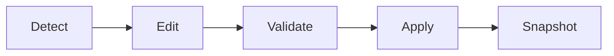

# gpu-spoofer-configurator 🎛️🖥️

  

*Rewrite how your GPU introduces itself to the OS — one clean config, zero guesswork.*

  

---

## 🔍 Overview

`gpu-spoofer-configurator` is a standalone Windows utility built to give you granular control over how your graphics adapter reports its identity to the system, drivers, and applications. Think of it as a control panel for the GPU's "handshake" — vendor strings, device descriptors, and reporting metadata all become editable fields instead of hard-coded silicon facts. It grew out of a very simple frustration: too many GPU-identity tools are either abandoned scripts from a forum thread circa 2019, or bloated suites that require three other programs just to open.

This project exists for the tinkerers, the driver hobbyists, the QA testers who need to validate software behavior across "different" hardware profiles, and the privacy-conscious users who don't love broadcasting their exact GPU fingerprint to every telemetry hook that asks. If you've ever needed to test how an application behaves against a spoofed GPU vendor string, or you just want a tidy, versioned way to manage identity profiles instead of hand-editing registry keys at 2 AM — this is built for you.

We built it solo, we ship it fast, and we treat the README like documentation should be treated: honest, complete, and something you can actually act on in under five minutes. No telemetry, no account wall, no "sign up to download." Just a configurator that does the one job it promises.

> [!NOTE]
> This tool operates entirely at the presentation/reporting layer. It does not modify GPU firmware, VBIOS, or physical hardware in any way.

---

## ⚡ What It Actually Does

- **Identity Profile Editor** — swap vendor ID, device ID, and subsystem strings through a form, not a hex editor.
- **Profile Presets Library** — a growing set of community-submitted GPU profiles you can load in one click instead of typing values by hand.
- **Live Preview Panel** — see exactly what a downstream app or driver query would read *before* you commit any change.
- **Snapshot & Rollback** — every configuration change is checkpointed, so reverting to your original GPU identity is a single button press.
- **Multi-GPU Awareness** — laptops and desktops with hybrid graphics (integrated + discrete) are detected and handled as separate targets.
- **Config Export/Import** — save a profile as a portable file and hand it to a teammate or load it on another machine.
- **Session Logging** — a readable log of what changed, when, and what it reverted to, so you're never guessing what state you're in.
- **Zero-Telemetry Design** — nothing phones home. What happens on your machine stays on your machine.

> [!TIP]
> Start with a **Snapshot** before your first edit. It costs one click and saves you a system restore later.

---

## 🚀 Get Started

1. **Visit the landing page** using the download button above — that's the only official distribution point.
2. **Download the latest build** — it's a single portable executable, no installer wizard, no bundled toolbars.
3. **Run it** — right-click → Run as Administrator (required for identity-layer access).
4. **Pick a profile or build your own**, hit Apply, and confirm the live preview matches what you expect.

That's it. No dependency chain, no runtime to install separately, no config file to hand-craft before first launch.

---

## 🧩 System Requirements

| Requirement | Details |
|---|---|
| OS | Windows 10 (64-bit) or Windows 11 |
| Architecture | x64 only |
| Dependencies | None — fully standalone binary |
| Admin rights | Required for applying identity changes |
| Disk space | Under 50 MB |
| .NET / runtimes | Not required — statically packaged |

  

> [!IMPORTANT]
> Older 32-bit systems are not supported. Given the age of hardware that implies, this is by design, not oversight.

---

## 🛠️ How It Works

The configurator operates in four straightforward stages, each visible in the UI so you're never left wondering what's happening under the hood:

1. **Detection** — the app enumerates connected GPUs and reads their current reported identity.
2. **Editing** — you modify fields in a structured form (vendor, device, subsystem, revision).
3. **Validation** — changes are checked against a schema so you can't accidentally submit malformed identity data.
4. **Application** — the new profile is committed at the reporting layer, and a rollback snapshot is stored automatically.

Why does Validation exist as its own step?

Because malformed vendor/device ID pairs can cause drivers to behave unpredictably — sometimes refusing to load, sometimes silently misreporting capabilities. Validation catches format errors and known-bad combinations before anything touches the live system.

---

## 🧯 Troubleshooting

**Q: The app won't apply changes — nothing happens when I click Apply.**
A: You almost certainly didn't launch as Administrator. This is the #1 reported issue.

**Q: My display driver crashed or reset after applying a profile.**
A: Use the Rollback button, or reboot — the pre-change snapshot is stored locally and restores automatically on next launch if a crash is detected.

**Q: A game or benchmark still shows my real GPU name.**
A: Some applications query hardware through paths other than the standard reporting layer. Not every software title reads identity the same way — this is an application-level limitation, not a configurator bug.

**Q: Can I run this on a VM?**
A: Yes, virtualized GPUs (including passthrough setups) are supported, though behavior varies by hypervisor.

**Q: I loaded a community preset and now my resolution options changed.**
A: Some presets emulate different device classes, which can affect what modes the driver reports as available. Roll back and pick a more conservative profile.

**Q: Does this survive a reboot?**
A: Yes — profiles persist until you roll back or apply a new one. That's the point of Snapshot & Rollback.

---

## 🎨 UI / UX Details

The interface is deliberately minimal — one window, no nested settings labyrinths.

- **Themes:** Dark (default), Light, and a high-contrast mode for accessibility.
- **Keyboard shortcuts:**
  - `Ctrl+S` — save current profile
  - `Ctrl+Z` — rollback to last snapshot
  - `Ctrl+P` — open preset library
  - `F5` — refresh detected GPU list
  - `Esc` — close active dialog
- **Settings panel** persists between sessions (theme, window size, last-used profile path).
- **Live Preview** updates in real time as you type — no "commit to see" friction.

> [!WARNING]
> Applying a profile mid-render (e.g., while a game or GPU-heavy task is running) can cause instability. Close demanding applications first.

---

## 🤝 Contributing & Community

This started as a solo project, but it grows through the people who actually use it. Contributions of every size are welcome — typo fixes, new presets, UI polish, or entirely new modules.

- **Discussions tab** — ask questions, propose features, show off your setup.
- **Issues** — bug reports with repro steps get picked up fastest.
- **Pull requests** — fork, branch, PR. Keep changes focused; small PRs merge faster than giant ones.
- **Preset submissions** — if you've built a solid GPU profile, submit it to the community presets folder.

> [!NOTE]
> Check the **Roadmap** discussion pinned at the top of the Discussions tab before starting large features — it avoids duplicate work and keeps everyone's effort pointed the same direction.

Roadmap highlights currently open for community input:

- [ ] Batch profile scheduling
- [ ] Extended multi-GPU profile chaining
- [ ] Community preset voting/rating system
- [ ] Optional CLI companion mode

---

## 📄 License

Released under the [MIT License](LICENSE), 2026. Use it, fork it, ship it in your own tools — just keep the license notice intact.

---

## ⚠️ Disclaimer

This software is provided for legitimate testing, development, privacy, and configuration purposes. Users are solely responsible for ensuring their use complies with the terms of service of any software, platform, or hardware vendor they interact with. The maintainers of this project assume no liability for misuse.

